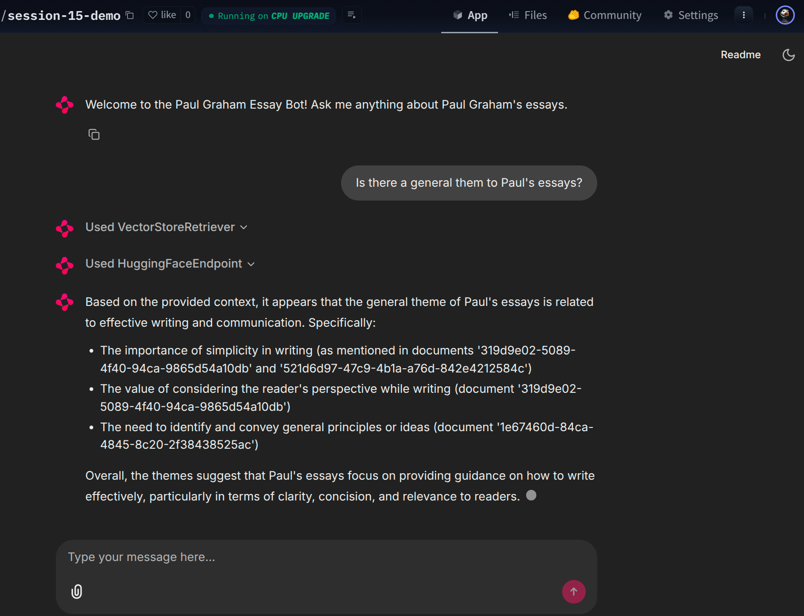
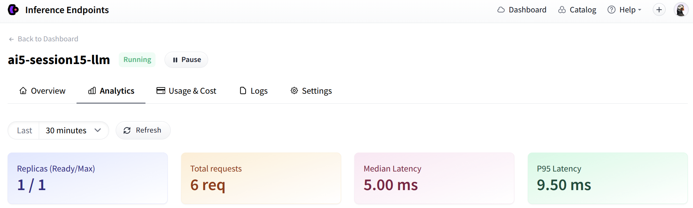
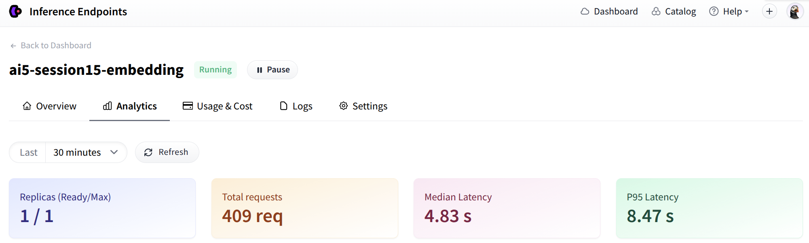

# Notebook link
https://github.com/drewgenai/AIE5/blob/main/15_Open_Source_Endpoints/Assignment_Open_Source_RAG_Leveraging_Hugging_Face_Endpoints_through_LangChain.ipynb

# Hugging face application leveraging inference endpoints link
## github repo
https://github.com/drewgenai/session-15-demo

## hugging face app inference endpoints shutdown now
https://huggingface.co/spaces/drewgenai/session-15-demo/tree/main

# screenshots of the app and the inference endpoints for llm and embedding

